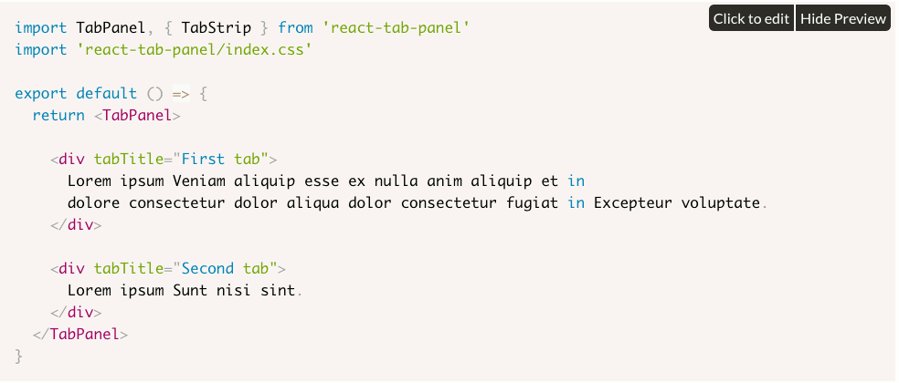

# react-tab-panel

> Carefully crafted tabs for React

# Docs

Visit the docs site at [zippyui.com/docs/react-tab-panel](http://zippyui.com/docs/react-tab-panel)

[](http://zippyui.com/docs/react-tab-panel)

# Install

```sh
$ npm install --save react-tab-panel
```

## Coming soon - scrollable tabs

## Usage

```jsx
import TabPanel from 'react-tab-panel'

import 'react-tab-panel/index.css'

<TabPanel>
  <div tabTitle="First Tab">
    First tab contents here
  </div>  

  <YourComponent tabTitle="Second Tab">
    Content for second tab here
  </YourComponent>
</TabPanel>
```

## Examples

For brevity, we are not showing the `import` statements in the examples below (with a few exceptions, where appropriate)!

### Stretching tabs:

```jsx
<TabPanel tabAlign="stretch">
  <div tabTitle="First Tab">
    First tab contents here
  </div>  

  <YourComponent tabTitle="Second Tab">
    Content for second tab here
  </YourComponent>
</TabPanel>
```

Possible `tabAlign` values:
 * `start`
 * `center`
 * `end`
 * `stretch`
 * `space-around`
 * `space-between`

### Disabled tabs:

```jsx
<TabPanel activeIndex={1}>
  <div
    tabTitle="First Tab"
    tabProps={{disabled: true}}
  >
    First tab contents here
  </div>  

  <YourComponent tabTitle="Second Tab">
    Content for second tab here
  </YourComponent>
</TabPanel>
```

For disabled tabs, just specify `tabProps={{disabled: true}}` on the component you want to show as disabled.

### Using `tabProps`

As an alternative to `tabTitle`, you can use `tabProps`, which should be an object with at least the `title` property.

You can use this property to pass in any custom props to tab titles

```jsx
<TabPanel activeIndex={1}>
  <div
    tabProps={{title:'First tab here'}}
  >
    First tab contents here
  </div>  

  <YourComponent
    tabProps={{
      title: 'Second Tab',
      disabled: true,
      onClick: (e) => console.log(e)
    }}
  >
    Content for second tab here
  </YourComponent>
</TabPanel>
```

### Using the `TabStrip`

```jsx
import TabPanel, { TabStrip } from 'react-tab-panel'

<TabPanel activeIndex={1}>

  <TabStrip
    style={{padding: 10}}
  />

  <div tabTitle="First tab here">
    First tab contents here
  </div>  

  <YourComponent tabTitle="Second Tab">
    Content for second tab here
  </YourComponent>

</TabPanel>
```

## Structure

```
*-------------------*
|    Tab Strip      |
*-------------------*
|                   |
|    Tab Body       |
|                   |
*-------------------*
```

The `TabPanel` is built of a `TabStrip` and a `TabBody`.

### TabStrip

The TabStrip basically renders the tabs at the top (or bottom) of the component.

By default, when rendering a `TabPanel` you don't have to render a `TabStrip` explicitly. However, doing so gives you greater flexibility in configuring and positioning it.

Example, with `TabStrip`

```jsx
import TabPanel, { TabStrip } from 'react-tab-panel'

<TabPanel
  activeIndex={x}
  onActivate={onActivate}
>
  <TabStrip style={{padding: 20}} />

  <div tabTitle="First Tab">
    First tab contents here
  </div>  

  <YourComponent tabTitle="Second Tab">
    Content for second tab here
  </YourComponent>
</TabPanel>
```

The `TabPanel` detects you are using the `TabStrip` inside it, and won't render it as a tab, instead, you can configure it's style and other props.

You can even use the `TabStrip` in isolation, without the `TabPanel`:

```jsx
import { TabStrip } from 'react-tab-panel'

let x = 1
let onActivate = (newIndex) => { ... }

const tabs = [
  'First tab',
  <b>second tab</b>
]
<TabStrip
  tabs={tabs}
  activeIndex={x}
  onActivate={onActivate}
/>
```

#### Configuration

If you are using the `TabStrip` as a standalone component, you can specify the following props:

 * `tabs: Array` - an array of ReactNode elements, which will be the tab titles
 * `activeIndex` - the index of the tab to render as active. **Controlled prop**!
 * `defaultActiveIndex` - uncontrolled version of `activeIndex`
 * `onActivate: Function(index)` - function to be called when a new tab is clicked & activated.

### TabBody

Renders the active tab contents.

You can include a `TabBody` inside your `TabPanel` to configure how the current tab content is rendered.

Example:

```jsx
import TabPanel, { TabBody, TabStrip } from 'react-tab-panel'

<TabPanel>

  <TabBody style={{padding: 100}}>
    <div tabTitle="First tab">
      Lorem ipsum Nisi fugiat ut nulla consectetur reprehenderit.
    </div>
    <YourComponent tabTitle="Second"/>
  </TabBody>

  <TabStrip />
</TabPanel>
```

The `TabPanel` will detect you are using a `TabBody` inside, and will use its children as tabs, and not the children of the `TabPanel`.
You can even use a `TabStrip` and include it after the `TabBody` as an alternative way of configuring the `tabPosition` to `'bottom'`

#### Configuration

 * `renderContent: Function` - a function that gets passed the content to render in the `TabBody`. You can use this to add some nesting and/or custom styling, etc.

The `TabBody` accepts any other normal `JSX` props. Eg: `onClick`, `style`, `className`, etc

#### Styling

It's default className will be `'react-tab-panel__body'`. If you configure it with another className, it will use both yours and the default value.


## Configuration

 * `children` with `tabTitle` prop as tabs
 * `tabPosition` - `'top'` or `'bottom'` are possible values. By default the `TabPanel` will render tabs at the top.

## Theming

For the default look&feel, just import `react-tab-panel/index.css`, which includes the structural styles as well as the default theme.

If you want to use only the structural styles, make sure you only include `react-tab-panel/base.css` and then add your own custom theme on top of those styles.

```jsx
import TabPanel from 'react-tab-panel'

//now import the css files
import 'react-tab-panel/index.css' //for the default look

//the css import above is equivalent to
import 'react-tab-panel/base.css'
import 'react-tab-panel/theme/default.css'
```

If you want to show the `TabPanel` with another theme, don't forget to also specify the `theme` prop on the component:


```jsx
<TabPanel theme="flat" ... />
```

### Available themes:

 * `default`
 * `red`
 * `flat`

## License

## LICENSE

#### [Apache2](./LICENSE)
